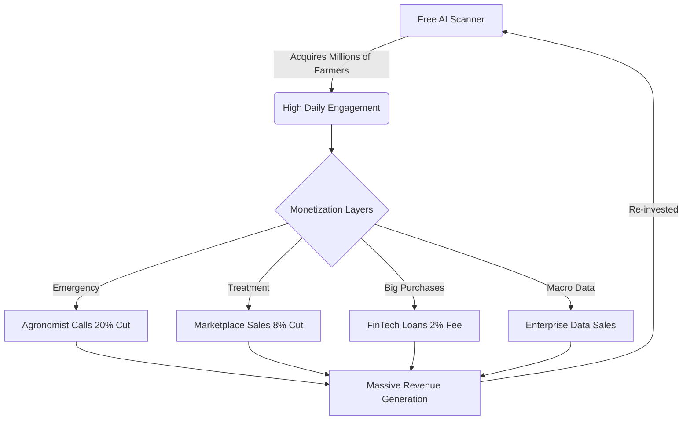

# 🌾 Plant Doctors: Business & Strategic Value Proposition

This document outlines the business case, unique selling propositions (USPs), and the direct impact of **Plant Doctors** on the agricultural ecosystem.

---

## 👔 The Executive Vision
**Plant Doctors** is not just an app; it is a **localized agricultural intelligence platform**. It bridges the gap between expert scientific knowledge and the small-scale farmer using cutting-edge AI, Voice technology, and Community data.

### 💰 Why it's a Billion-Dollar Business Case:
1.  **Massive Market**: Over 100 million farmers in India alone struggle with crop disease, leading to 15-25% crop loss annually.
2.  **AI-Driven Scalability**: Traditional agricultural extension services (human experts) cannot reach every village. Our AI scales to millions of users at near-zero marginal cost.
3.  **Data as an Asset**: By collecting real-time disease outbreak data, the platform becomes a "Predictive Intelligence" tool for government and pesticide companies.

---

## ⚡ Unique Selling Propositions (USP)

What makes **Plant Doctors** stand out from generic agri-apps:

1.  **🗣️ Outbound AI Expert Call (Voice-First)**:
    - **The Innovation**: Farmers often find typing difficult. Our platform uses **Vapi AI** to call the farmer directly.
    - **Language**: The AI speaks in **Hinglish** (Hindi + English) and local dialects, building immediate trust.
2.  **🛰️ Community Early Warning System**:
    - **The Innovation**: If 14 farmers in a 10km radius report a pest, the system automatically alerts everyone nearby.
    - **Benefit**: It stops an outbreak before it becomes a disaster.
3.  **📊 Smart Dosage Calculator**:
    - **The Innovation**: Precise calculation based on acreage.
    - **Business Edge**: Reduces chemical waste, saving farmers money and protecting the soil.

---

## 🚜 Farmer Benefits: Simple & Direct

| Feature | Farmer Benefit | Economic Impact |
| :--- | :--- | :--- |
| **AI Scanner** | Instant diagnosis on the field. | No travel cost to experts; 48hr faster response. |
| **Voice Doctor** | Human-like conversation in mother tongue. | High adoption even for less tech-savvy farmers. |
| **Mandi Price AI** | Real-time market price trends. | Farmers sell at the right time for 10-15% higher profit. |
| **Weather Alerts** | "Don't spray today" rain warnings. | Avoids wasting ₹500 - ₹2000 per spray in chemicals. |

---

## 🛠️ Feature-to-Technology Mapping

| "What is it?" (Feature) | "How is it built?" (Technology) | Business Outcome |
| :--- | :--- | :--- |
| **Disease Detection** | PyTorch + MobileNetV3 | High-accuracy diagnostic reliability. |
| **Voice Interaction** | Vapi.ai + GPT-4o-mini | High engagement and emotional trust. |
| **Marketplace** | Razorpay + MongoDB | Secure, high-conversion B2B/C2C commerce. |
| **Analytics** | Recharts + FastAPI | Data-driven decision making for admin & farmers. |

---

## 📈 Revenue & Growth Model

1.  **Premium Subscriptions**: Access to 24/7 priority AI Voice Calls and PDF Health Reports.
2.  **Marketplace Commission**: Small fee on sales of seeds, fertilizers, and used equipment (C2C).
3.  **B2B Advertising**: Targeted ads for fertilizer and pesticide brands based on detected diseases in a specific area.
4.  **Data Intelligence**: Providing anonymized pest outbreak heatmaps to government agencies.

---

## 🏁 The Competitive Advantage
Traditional apps are either "Information Only" or "Marketplace Only." **Plant Doctors** is "Intelligence First." We solve the farmer's pain point (disease) first, then provide the solution (medicine/expert), creating a **seamless trust-to-transaction loop**.

---
> **"Empowering the hands that feed the world through Localized AI Intelligence."** 🌍🌾
# 💰 Plant Doctors: Global Revenue Model
**Path to a Billion-Dollar Agritech Valuation**

The Plant Doctors monetization strategy is explicitly designed to be **founder-friendly, highly scalable, and non-exploitative to farmers**. By distributing the cost across multiple stakeholders (FinTech partners, Corporate Agribusinesses, and Premium Services), the core plant-scanning utility remains free, driving massive user acquisition.

---

## 📊 1. Core Revenue Streams

### 📞 A. Tele-Agronomy & Expert Consultations 
**Model: Commission-Based per Session**
Farmers can instantly connect with certified agricultural scientists or local agronomists for emergency support (e.g., severe locust swarms, complex blights).
* **Pricing Strategy:** ₹99 to ₹299 per 15-minute consultation.
* **Platform Cut:** The app retains a **20-30% platform fee** for facilitating the VOIP call, recording the session, and providing AI-transcribed notes to the farmer.
* **Scale Factor:** High. Emergency disease outbreaks naturally drive high-volume micro-transactions.

### 🛒 B. Agritech Marketplace Commissions
**Model: B2B & C2C Transaction Fees**
The integrated "Krishi Bazaar" allows farmers to buy seeds, rent heavy machinery, or purchase verified pesticides.
* **C2C (Farmer to Farmer):** 0% commission (to drive engagement and daily active users).
* **B2B (Brands to Farmers):** **5-8% commission** on all verified seeds, fertilizers, and chemical purchases made through the app.
* **Scale Factor:** Massive. By integrating logistics, Plant Doctors becomes the Amazon of Agriculture.

### 💳 C. Embedded FinTech & Micro-Lending (Razorpay)
**Model: Loan Origination & EMI Splits**
High-value machinery (tractors, automated sprayers) is expensive. We integrate with local NBFCs (Non-Banking Financial Companies) to offer smart EMIs.
* **Origination Fee:** We charge a **1.5% to 2% flat fee** to the bank for every successfully issued machinery loan.
* **Scale Factor:** Very high profit margins. The app's data acts as a credit-score proxy (better farm health = lower default risk).

---

## 💎 2. Premium Subscriptions (SaaS for Farmers)

### 🌟 "Plant Doctors PRO" (₹499 / Year)
Targeted at commercial farmers and large-acreage land owners.
* **Unlimited Offline Scans:** Download the AI model locally to the phone for areas with zero internet connectivity.
* **Priority Expert Queue:** Skip the waiting line when calling human agronomists.
* **Early Warning Radar:** Get SMS/WhatsApp alerts 48 hours before an anticipated pest swarm hits their specific GPS coordinates.
* **Drone Mapping Discounts:** Discounted integrations with third-party drone-spraying services.

---

## 📈 3. Enterprise & Corporate Revenue (B2B SaaS)

> [!IMPORTANT]
> **Absolute Data Privacy:** We never sell individual farmer phone numbers or exact private locations. All data is highly aggregated and anonymized.

### 📡 A. Predictive Commodity Intelligence
**Clients: Wall Street Hedge Funds, Commodity Traders, Governments**
* **The Product:** Because Plant Doctors scans thousands of crops daily, we know exactly *where* and *when* a major crop failure (e.g., wheat rust across Punjab) is happening *before* the government does. 
* **Revenue:** Six-figure annual licensing contracts for access to our predictive yield dashboards. Traders use this to short/long wheat and rice futures.

### 🎯 B. Hyper-Local Brand Sponsorships 
**Clients: Bayer, Syngenta, Local Fertilizer Brands**
* **The Product:** If a farmer's crop is diagnosed with "Apple Scab", the AI naturally recommends a "protective foliar fungicide". Brands can pay to have their specific, highly-rated fungicide appear as the top "Sponsored Recommendation".
* **Revenue:** Cost-Per-Click (CPC) or Cost-Per-Acquisition (CPA) ad revenue.

---

## 🔄 The Flywheel Effect (Visualized)

---

## 🎯 3-Year Projection

| Phase | Year | Primary Focus | Target Revenue Projection |
|-------|------|---------------|---------------------------|
| **Phase 1** | Year 1 | User Acquisition & Free AI Usage | Minimal (Focused on VC Valuation growth) |
| **Phase 2** | Year 2 | Marketplace Launch & Expert Calls | $2M - $5M ARR |
| **Phase 3** | Year 3 | FinTech Lending & Enterprise Data | $25M+ ARR |

> [!TIP]
> **The Golden Rule:** Never charge the smallholder farmer for the core diagnostic tool. The AI must remain free to ensure we capture 100% of the data market share. We monetize the *solutions* (medicines, loans, experts), not the *diagnosis*.
# Plant Doctors Startup Growth Review

## What Was Upgraded Now

### 1. Community Backend Upgrades (implemented)
- Upgraded `/api/v1/community/posts`:
  - Better post schema (`crop`, `tags`, `shares`, `saves`)
  - Guest-safe posting support (works even without auth token)
  - Built-in business hint in response for monetization routing
- Added `POST /api/v1/community/posts/{post_id}/engage`:
  - Track `like`, `comment`, `share`, `save` events
- Added `GET /api/v1/community/insights`:
  - Engagement analytics
  - Top crops / top creators
  - Revenue opportunity suggestions with monthly INR estimates
- Added `POST /api/v1/community/ask-assist`:
  - Converts raw farmer question to high-quality community post format
  - Suggests tags + action checklist

### 2. Ask Community Button Flow (implemented)
- `Ask Network` flow upgraded to backend-assisted `Ask Community` flow.
- Button now:
  - Opens discuss composer
  - Calls `ask-assist` backend endpoint
  - Prefills better post text
- Composer now:
  - Actually submits post to backend
  - Shows posting state + error/success feedback
  - Supports Enter-to-send

### 3. Community Growth Widget (implemented)
- Added `Growth Pulse` card in discuss tab:
  - Live post volume
  - Top trend crop
  - Revenue opportunity estimate

---

## High-Impact Revenue Features (Next Priority)

### P0 (quick revenue wins)
1. Expert Conversion Funnel
   - Auto-route high-intent community posts to paid expert calls.
   - KPI: `community_post -> expert_call booking rate`.

2. Contextual Marketplace Bundles
   - Under each disease post, show “recommended treatment kit”.
   - KPI: `community_session -> store checkout`.

3. Sponsored Placement
   - “Sponsored Reels / Sponsored Discuss thread” for agri brands.
   - KPI: ad fill rate + sponsored revenue/month.

### P1 (retention + ARPU)
1. Premium Farmer Club
   - Faster expert response, private groups, seasonal advisory packs.
2. Crop Intelligence Reports
   - Weekly paid insights PDF by crop/region.
3. Partner Dealer Leads
   - Sell verified purchase leads to local agri-input shops.

### P2 (scale)
1. B2B Dashboard for Agri Companies
   - Trend detection + campaign analytics.
2. API Licensing
   - Disease + dosage recommendation API for third-party apps.

---

## Suggested KPI Dashboard

1. `DAU`, `WAU`, `MAU`
2. Post creation rate/day
3. Engagement score/post
4. Expert call conversion from community
5. Marketplace conversion from community
6. Revenue by channel:
   - Expert calls
   - Store margin
   - Sponsored content
   - Subscription

---

## 30-60-90 Day Execution Plan

### 30 Days
- Stabilize new community pipeline + track conversion events.
- Launch Expert CTA under high-intent posts.

### 60 Days
- Launch crop-specific treatment bundles.
- Start 2 pilot sponsored placements.

### 90 Days
- Launch premium membership tier.
- Add B2B insights pilot for one agri brand partner.
# Plant Doctors - Honest CTO Review and Real Execution Plan
Date: April 1, 2026  
Mode: Production reality check (not UI cosmetics)

## 1) Brutal Snapshot (Pehle vs Abhi)

### Pehle (Hackathon-level risk)
- Model trust weak: mostly PlantVillage in-domain confidence.
- Backend had overloaded `main.py` and mixed concerns.
- Critical APIs had fallback/mock behavior.
- User identity and history were weak/inconsistent.
- Expert call flow had no robust status tracking.
- Observability was minimal (no proper drift or version visibility).

### Abhi (Real upgrade foundation done)
- Modular production stack added under `backend/app/{api,services,models,core}`.
- Production v1 APIs added: auth, scan, feedback, users, geo, expert calls, admin AI.
- JWT auth + password hashing + user history APIs live.
- Confidence-threshold based escalation added in scan inference.
- Prediction logs + feedback logs + model registry + observability API implemented.
- Expert call retries with backoff implemented.
- Docker, compose, CI, env template, backend tests added.
- New readiness + call webhook + call analytics now added in v1.

## 2) Abhi ki Achchai (Real strengths)
- Strong architecture direction: service-layer split exists and is usable.
- Trust features exist in code: low-confidence escalation, logging, feedback loop.
- Admin visibility exists: accuracy endpoint, observability endpoint, readiness endpoint.
- Safety path exists: AI uncertain -> human escalation flow.
- Test baseline improved: health, security, inference fallback, admin routes, webhook parsing.

## 3) Abhi ki Kharabi (Blockers before scale)
- Legacy monolith routes in `backend/app/main.py` still exist and remain large.
- Full frontend migration to `/api/v1/*` is not complete.
- Field accuracy is still not proven until real farmer dataset evaluation runs in production cycle.
- In-memory rate limiting is not multi-instance safe; Redis limiter still needed.
- No async job queue for heavy tasks (training/evaluation/notification fanout).
- No full provider failover for calls (single-provider dependency risk).
- No data governance workflow yet (label quality, consent, retention, audit).

## 4) Top 10 Improvements (Priority order)

### Critical (P0)
1. Remove production traffic from legacy routes; force all client traffic to `/api/v1/*`.
2. Run real field validation and publish `field_accuracy_pct` (separate from in-domain accuracy).
3. Add Redis-based distributed rate limiter for multi-instance backend.
4. Implement call provider failover (Vapi primary, Twilio fallback) with webhook status sync.
5. Add data quality pipeline for farmer images: dedupe, blur filter, wrong-label quarantine.

### High (P1)
6. Add async workers (Celery/RQ) for outbound alerts, retraining jobs, and heavy analytics.
7. Add district-level outbreak detection and trigger-based SMS/WhatsApp alerts.
8. Add strict SLO dashboards: scan latency p95, low-confidence rate, call success rate.

### Medium (P2)
9. Add model calibration by crop family and uncertainty bucketing.
10. Add full audit logs for admin actions, model activation, and critical config changes.

## 5) Lightweight Dataset Strategy (M4-friendly, real-world)

Use medium-size, high-signal data mix instead of huge heavy datasets:

- PlantVillage (existing): strong baseline but lab-like images.
- PlantDoc: real field noise, blur, background clutter.
- Farmer pilot dataset (your own): highest business value.
- Optional targeted sets by crop priority:
  - Rice leaf disease small curated set
  - Wheat rust focused set
  - Tomato field disease set

Recommended first production training pool:
- 8k to 18k total curated images.
- At least 20% real field images.
- Minimum 300 to 500 samples/class for top disease classes.
- Keep a strict holdout by district/time (not random-only split).

## 6) Backend and AI - What improved in this pass
- `backend/app/services/prediction_log_service.py`
  - Added p50/p95 latency, model version breakdown, feedback summary integration, drift signal (JSD).
- `backend/app/api/routes/admin_ai.py`
  - Added richer `model/accuracy` response with feedback + field validation attachment.
  - Added `GET /api/v1/admin/ai/readiness` for launch blockers.
- `backend/app/services/expert_call_service.py`
  - Added webhook payload parser and call status update flow.
- `backend/app/api/routes/expert_calls.py`
  - Added `POST /api/v1/expert/webhook/vapi`.
  - Added `GET /api/v1/expert/analytics` (admin).
- `backend/app/core/config.py`
  - Added `VAPI_WEBHOOK_SECRET` and `field_validation_report_path`.
- `backend/app/core/database.py`
  - Added indexes for call status and call ID.
- `backend/.env.example`
  - Added `VAPI_WEBHOOK_SECRET`.
- Tests added:
  - `backend/tests/test_expert_call_webhook.py`
  - `backend/tests/test_admin_ai_routes.py`

## 7) Step-by-Step Execution (Next, one by one)

### Step A (Week 1) - Completed in codebase
- Frontend core flows locked to `/api/v1/*`.
- Added `ENABLE_LEGACY_API=false` production gate for old routes.
- Admin telemetry switched from mock business cards to real backend/model signals.

### Step B (Week 2-3)
- Collect and clean first farmer dataset batch.
- Run `evaluate_field.py` and publish field validation report.
- Set confidence threshold using real field accuracy tradeoff.

### Step C (Week 4-5)
- Add Redis limiter + background worker queue.
- Add call failover and webhook reconciliation job.

### Step D (Week 6-8)
- Add outbreak alerts + mandi + weather-risk notifications.
- Add KPI dashboard for operations and model trust.

## 8) Real Launch Criteria (must pass)
- Field accuracy baseline published and monitored weekly.
- Low-confidence escalation coverage >= 95% for unsafe predictions.
- Expert call success rate >= 90% with failover.
- p95 scan latency SLO defined and tracked.
- Zero mock data in production customer-facing APIs.
- Incident + rollback playbook documented.

---

If you want, next pass can directly execute **Step A hard-cutover**: frontend routes fully migrated to `/api/v1`, legacy endpoints marked deprecated, and production lock enabled with a kill-switch.
