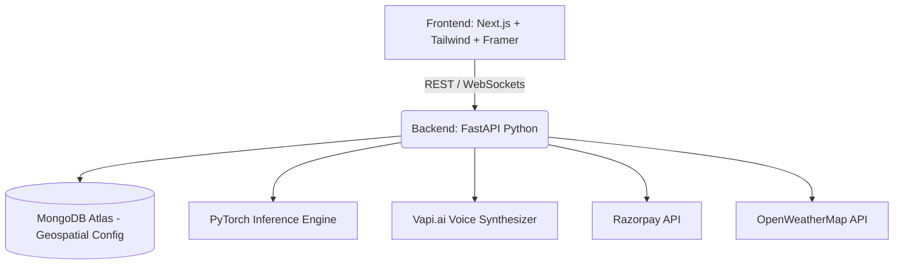

<div align="center">
  
  
  <h1>🌿 Plant Doctors AI</h1>
  <h3>The Billion-Dollar Agritech Experience</h3>
  
  <p>
    <b>Empowering Farmers with Cutting-Edge AI, Localized Intelligence, and Precision Agriculture.</b>
  </p>
  
  <div>
    
    
    
    
    
  </div>
</div>

---

## 🚀 Welcome to the Future of Farming

**Plant Doctors** is a state-of-the-art agricultural platform designed to bridge the gap between rural farming and advanced artificial intelligence. By combining high-accuracy computer vision, multi-lingual voice assistants, and community-driven threat mapping, we deliver an unprecedented precision farming experience.

Our core mission is simple: **Zero Crop Loss. Maximum Yield.**

---

## 💎 Core Capabilities & Features

### 1. 🔍 AI Crop Scanner
- **38,000+ Pathogen Detection**: Utilizing MobileNetV3-Large baked into an optimized PyTorch pipeline for ultra-fast, on-device level inference.
- **Real-Time AR Viewfinder**: An immersive, haptic-feedback enabled scanning experience.
- **Smart Dosage Calculator**: Automatically calculates chemical to water mix ratios based on farm acreage and localized ground soil data.
- **Automated PDF Reports**: Generates downloadable diagnostic PDFs in 7 regional languages for offline reference.

### 2. 🎙️ Localized Voice AI (Powered by Vapi.ai)
- **Outbound Expert Calling**: Smart AI agents that call farmers to ask diagnostic questions in their local dialects (Hindi, Bhojpuri, Punjabi, Marathi, etc.).
- **Voice Commands**: Fully integrated voice navigation for low-literacy users. "Mera aalu chota hai" instantly routes to potato growth care recommendations.

### 3. 🌍 Geo-Threat Network
- **Community Outbreak Mapping**: Live 2D sphere monitoring of nearby pest outbreaks.
- **Early Warnings**: Push notifications telling farmers to spray preventive solutions if >14 farmers report a specific disease within a 10km radius.
- **Live OpenWeatherMap Integration**: Rain, heat-wave, and wind alerts to strategically prevent farmers from wasting pesticide during adverse climates.

### 4. 🛒 Premium Agritech Marketplace
- **C2C & B2B Purchasing**: Connects farmers directly with pesticide sellers and heavy-machinery renters (tractors, harvesters).
- **Embedded Razorpay / EMI**: Micro-financing for high-value machines to make modernization affordable.

---

## 🏛️ Premium Policies & Guarantees

As a market-leading agritech organization, we strictly enforce the following **Premium Policies** to protect and serve our farmers.

### 🛡️ 1. Absolute Data Privacy & Zero-Selling Policy
We understand that farm yield data and land acreage are sensitive. 
- **Zero Third-Party Data Selling**: We will never sell crop health data, GPS locations, or mobile numbers to third-party ad networks or corporate agribusinesses.
- **End-to-End Encryption**: All voice logs, crop scans, and chat histories are highly encrypted.

### ⚖️ 2. AI Ethics & Transparency Policy
We recognize the physical cost of bad AI advice.
- **Confidence Thresholds**: If our AI is less than 75% confident in a disease diagnosis, it **will not guess**. It will gracefully escalate the case to a verified human agronomist.
- **Banned Chemicals Guardrail**: Our LLM and treatment recommendation engines are strictly programmed to *never* suggest internationally banned or highly hazardous pesticides. Organic alternatives are always presented first.

### ⏱️ 3. Expert Availability Service Level Agreement (SLA)
- **15-Minute Agronomist Connect**: For critical alerts (e.g., locust swarms, sudden blight), premium users are guaranteed a phone connection with a registered agricultural scientist within 15 minutes.

### 💳 4. Financial Fairness & EMI Policy
- **No Hidden Fees**: The marketplace utilizes transparent pricing logic. Equipment rentals are explicitly priced per hour/day.
- **Zero-Interest Micro-Loans**: We partner with local NBFCs to provide 0% EMI on critical disease-prevention sprayers and seeds.
- **100% Refund Guarantee**: If an agronomist consultation fails to resolve the issue within 14 days, the consultation fee is fully refunded.

---

## 💻 Technical Architecture

Plant Doctors utilizes a highly decoupled architecture for maximum scalability across rural 3G/4G networks.



#### Frontend Stack (Web & PWA)
- **Next.js 14** (App Router)
- **TailwindCSS** + Generic CSS Modules for ultra-premium Glassmorphism & Liquid UI.
- **Framer Motion** for micro-interactions and haptic-fluid animations.
- **Lucide React** for beautiful iconography.

#### Backend Stack
- **FastAPI** for asynchronous, extremely high-throughput API routing.
- **Motor (Asyncio)** for non-blocking MongoDB communication.
- **Redis** for blazingly fast in-memory caching of ML predictions and API routes.
- **ReportLab / FPDF** for dynamic, multi-lingual PDF generation.
- **gTTS** & **Vapi** for NLP and Text-to-Speech logic.

---

## 🛠️ Quick Local Setup

> [!CAUTION]
> Ensure you have Python 3.10+ and Node.js 18+ installed before proceeding.

### 1. Backend Setup

It is strongly recommended to have **MongoDB** and **Redis** running locally before starting the server.

```bash
cd backend
python3 -m venv venv
source venv/bin/activate
pip install -r requirements.txt

# Rename environment file
cp .env.example .env

# Start FastAPI Server (Runs on port 8000)
uvicorn app.main:app --reload
```

### 2. Frontend Setup
```bash
cd web
npm install

# Start Next.js Development Server (Runs on port 3000)
npm run dev
```

---

## 📜 Complete Delivery Documentation Index
If you are looking for specific phase deliveries, architectural blueprints, or UI/UX mockups, please refer to the detailed documentation suite linked below:

| Documentation category | Quick Link |
|-----------------------|------------|
| **Meet the Team** | [`TEAM.md`](./TEAM.md) |
| **Business Strategy & Revenue Plan** | [`BUSINESS_PLAN.md`](./BUSINESS_PLAN.md) |
| **Project Architecture & Folders** | [`ARCHITECTURE.md`](./ARCHITECTURE.md) |

---
<div align="center">
  <p>Built with ❤️ for the Global Farming Community.</p>
</div>
# AI-PLANT-DOCTOR-S-CC3H-102
# AI-PLANT-DOCTOR-S-CC3H-102
